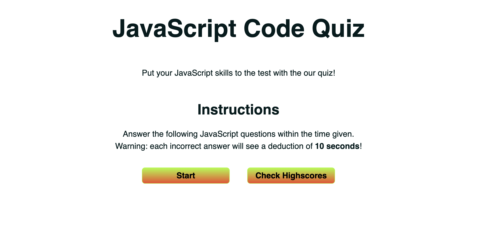
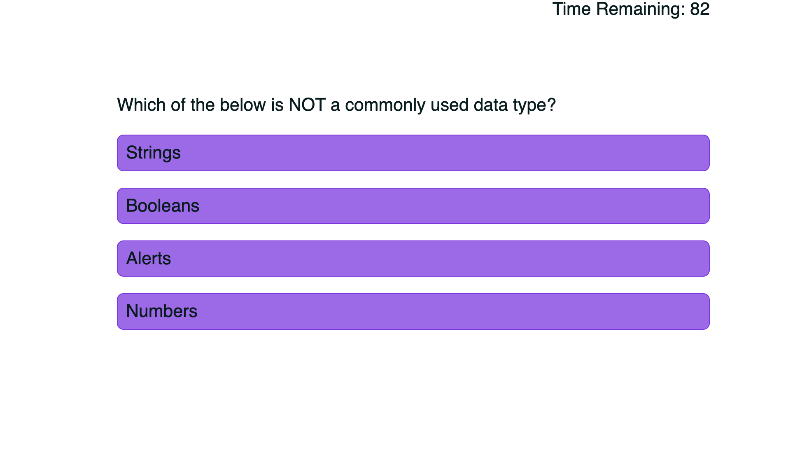
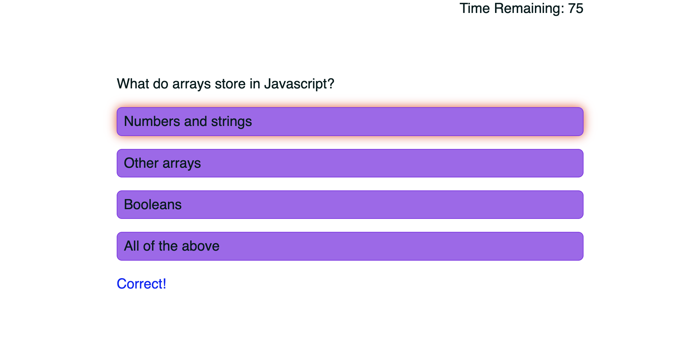
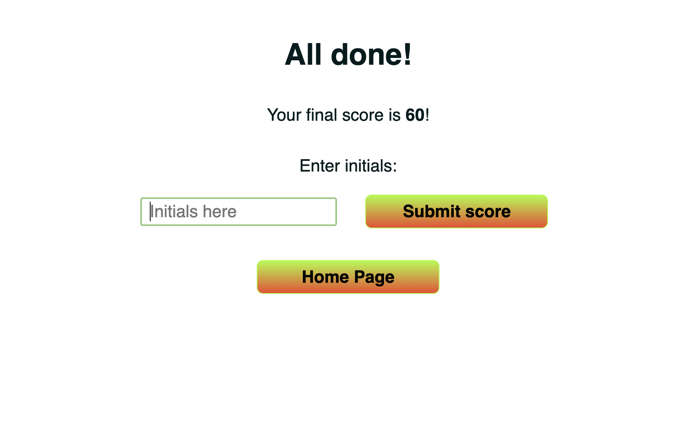
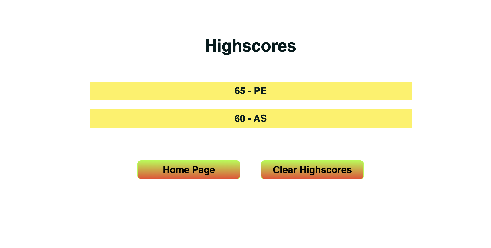

# JavaScript Code Quiz

## Description
The purpose of this project is to create a code quiz that tests a user's knowledge of JavaScript and allows them to compare their scores against their peers

## Requirements
- Ensure timer starts and user presented with a question when Start button clicked
- Ensure after a user answers a question they are presented with another question
- Ensure when user answers question incorrectly 10 seconds is subtracted from timer
- Ensure game is over once all questions answered or timer reaches 0
- Ensure initials and score can be saved after game is over

## Webpage Preview

## Link to Deployed Application
[Deployed Webpage](https://ajaycshan.github.io/ajay-portfolio/)